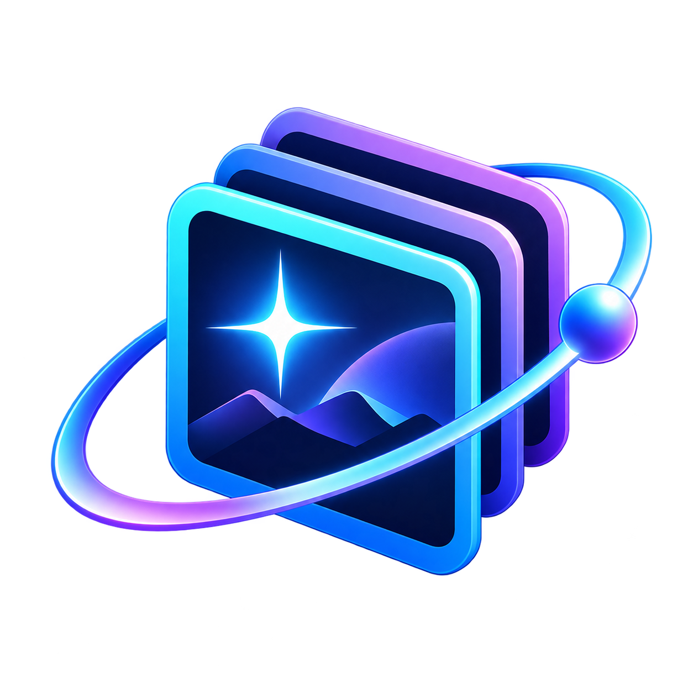

<div align="center">
  

# AstroArchive

**From telescope captures to an organised archive.**

A Windows desktop app for cataloguing smart-telescope FITS captures,<br>
verifying imports and preparing files for your next stack.

[](https://github.com/arijguest/AstroArchive/releases/latest)
[](https://github.com/arijguest/AstroArchive/actions/workflows/windows.yml)


**[Download for Windows](https://github.com/arijguest/AstroArchive/releases/latest)** &nbsp; · &nbsp; **[User guide](Application_Source/Quick_Start.txt)** &nbsp; · &nbsp; **[Report an issue](https://github.com/arijguest/AstroArchive/issues)**

</div>

---

## A home for every observing session

AstroArchive organises captures by target, telescope, session and camera, including
Seestar and DWARF folder layouts. Import from local storage, USB telescope devices
or filesystem-mounted cloud folders, then find the frames you need and export a
verified stacking project.

| Capability | What you can do |
| --- | --- |
| **Verified imports** | Import FITS and gzip-compressed FITS with SHA-256 verification and duplicate detection. Originals are kept by default. |
| **Telescope profiles** | Save devices, detect local USB storage, import missing captures and recover profiles from archive records. Rename a device across the selected archive. |
| **Capture review** | Search and filter by target, camera, night, session, exposure and more. Screen failed or rejected captures and import only the ready files shown. |
| **Image previews** | Inspect FITS, XISF and standard image formats with zoom, pan and display stretch. Preview adjustments leave source pixels unchanged. |
| **Stacking preparation** | Export selected files or create ready-to-stack folders with optional matching calibrations. Hand off a single FITS stack to supported AstroWizard or Siril builds. |
| **Archive history** | Track imports and deletions in SQLite so later telescope imports skip captures you deliberately removed. |

Drop FITS files into the archive’s `Dump` folder to process them at startup.
Verified imports and duplicates are cleared from that inbox; failed inputs remain
for review. Optional plate solving with ASTAP or Astrometry.net can identify
targets, and field-rotation analysis is also available.

## Install on Windows

**Requirements:** Windows 10 or 11, 64-bit, with .NET Framework 4.8 or later.

1. Open the [latest release](https://github.com/arijguest/AstroArchive/releases/latest).
2. Download `AstroArchive<package-version>.exe` from its assets.
3. Run the installer, then open AstroArchive from the Desktop or Start menu shortcut.

Installation works offline and requires no administrator access. The default
location is `%LOCALAPPDATA%\Programs\AstroArchive`; the installer also adds an
uninstaller to Windows Installed Apps.

> **Download verification:** The installer is currently unsigned. Each release
> includes SHA-256 checksum files; compare your download’s hash with the supplied
> checksum before running it. A checksum verifies file integrity, not publisher identity.

<details>
<summary><strong>Check the installer in PowerShell</strong></summary>

Replace the filename below with the installer you downloaded:

```powershell
Get-FileHash .\AstroArchive1.6.2.1.exe -Algorithm SHA256
```

Compare the `Hash` value with the corresponding `.sha256` file in the release.

</details>

<details>
<summary><strong>Upgrading from the original offline 1.2.0 installer</strong></summary>

Close AstroArchive and install the latest release once in the existing location
to enable future update checks. The [original offline installer](releases/offline-1.2.0)
remains available for reference.

</details>

## Your first import

1. **Choose an archive.** Open **Settings** and select the folder that will hold your captures.
2. **Add a telescope.** In **Import**, choose its capture folder and assign a unique physical device ID, such as `Seestar-01` or `Dwarf-03`.
3. **Review the scan.** Check the detected captures, use **Filters** to narrow the list and import the ready files shown.
4. **Prepare a stack.** Search the library, select frames with **Ctrl/Shift** and right-click to export files or create a stacking folder.

The [user guide](Application_Source/Quick_Start.txt) covers classification,
telescope profiles, cloud folders, calibration matching and optional analysis.

> **Moving or backing up an archive?** Keep `.astroarchive/index.sqlite` with
> the captures. Use one writer per archive, including archives in cloud folders.

## Failed captures

Enable **Import options > Ignore failed** to skip FITS filenames containing
`failed`, regardless of case. The setting is saved for folder, USB and Dump imports;
ignored originals stay in place. Rescan after changing it.

**Repository tools > Delete failed** lists matching captures across the active
repository for confirmation, regardless of the current filters. Deletion retains
source copies and shared metadata, and records checksums to prevent reimport.

## Formats and processing

| Task | Supported files or setup |
| --- | --- |
| **Archive import** | `.fit`, `.fits`, `.fts` and their gzip-compressed variants. |
| **Image preview** | FITS, XISF, TIFF, PNG, JPEG, BMP and GIF. Camera RAW support depends on installed Windows codecs. |
| **Convert before use** | Video, tile-compressed `.fz` and multi-frame scientific cubes. |
| **Plate solving** | A separately configured ASTAP installation and database, or an Astrometry.net account. |
| **Cloud folders** | Filesystem-mounted or streamed folders, including Google Drive for desktop. Browser-only folders cannot be used. |

Stacking runs in external software. AstroWizard and Siril handoffs use a separate
working copy; see [supported processors and handoff requirements](docs/PROCESSOR_HANDOFFS.md).
Preview support for a format does not make it eligible for archive import.

## Staying up to date

The Desktop and Start menu shortcuts open a launcher that checks the latest
stable GitHub release. If a newer package is available, **Install it now?** opens
with **Yes** selected. Choose **No** to open the installed version, or **Yes** to
download, verify, install and restart.

You can also use **Settings → Check for and install new releases**, then
**Install release**. The app verifies the download, saves state and restarts
automatically after installation.

- Updates preserve archives, images, manifests, caches and user settings.
- Downloads use HTTPS and SHA-256 verification. Public release checks require no GitHub login.
- Offline or failed checks leave the installed app available; older versions are refused.
- Running the portable app executable directly skips the launcher. Installing an update from a portable copy uses the registered or default installation location.

See the [update guide](docs/UPDATES.md) for manual checks, offline launch and troubleshooting.

## Build from source

AstroArchive uses **C# 5 and WPF**, targeting **.NET Framework 4.8**. Build on
Windows x64 with the .NET Framework compiler; no Visual Studio, SDK, NuGet or
Python installation is required.

```powershell
# Test the application and installer, build the package and run Windows smoke checks.
powershell -NoProfile -ExecutionPolicy Bypass -File .\scripts\build-release.ps1
```

Run release smoke checks on a **test account**: they temporarily register the app
and create shortcuts. Outputs are written to `release-artifacts/`.

[Windows CI](.github/workflows/windows.yml) runs on pushes to `main` and pull
requests. A new package version on `main` automatically publishes a tested
installer, checksums and update feed. Existing published releases are retained.
See the [release guide](docs/RELEASING.md) for versioning and publication.

| Location | Contents |
| --- | --- |
| [`Application_Source/`](Application_Source/README.md) | WPF application, catalogue, assets and generated-data tests. |
| [`Installer/`](Installer/README.md) | Installer, Windows integration, launcher and update tests. |
| [`scripts/`](scripts/build-release.ps1) | Windows release build and smoke validation. |
| [`docs/`](docs) | Updates, processor handoffs, release instructions and validation notes. |
| [`releases/offline-1.2.0/`](releases/offline-1.2.0) | Original installer and provenance. |

## Catalogue and licensing

The bundled catalogue derives from **OpenNGC by Mattia Verga**, licensed under
**CC BY-SA 4.0**. See [Catalogue_Notice.md](Application_Source/Catalogue_Notice.md)
and [OpenNGC_README.md](Application_Source/OpenNGC_README.md) for attribution and provenance.

The repository does not currently specify a licence for the application source.
