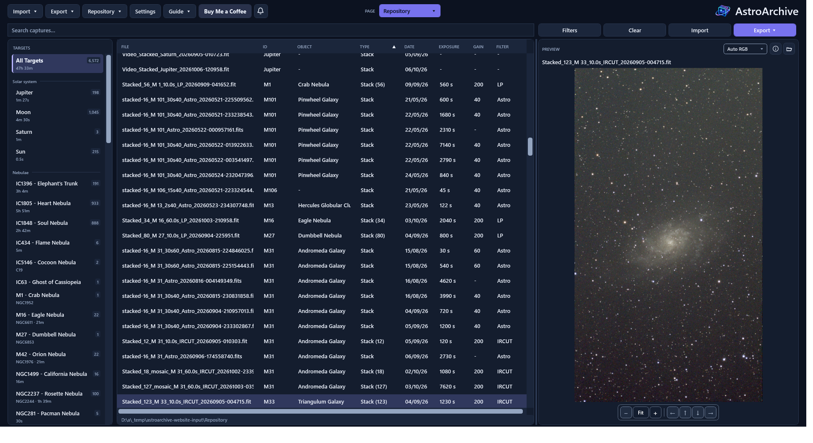
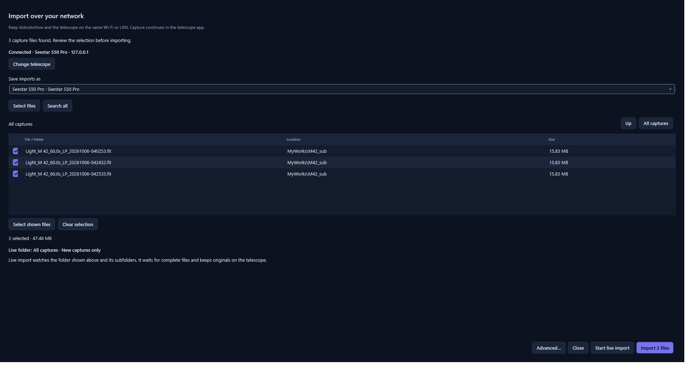
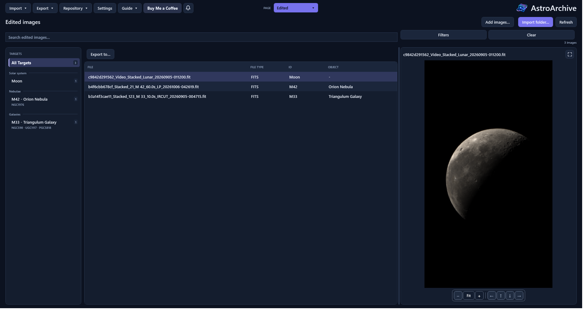
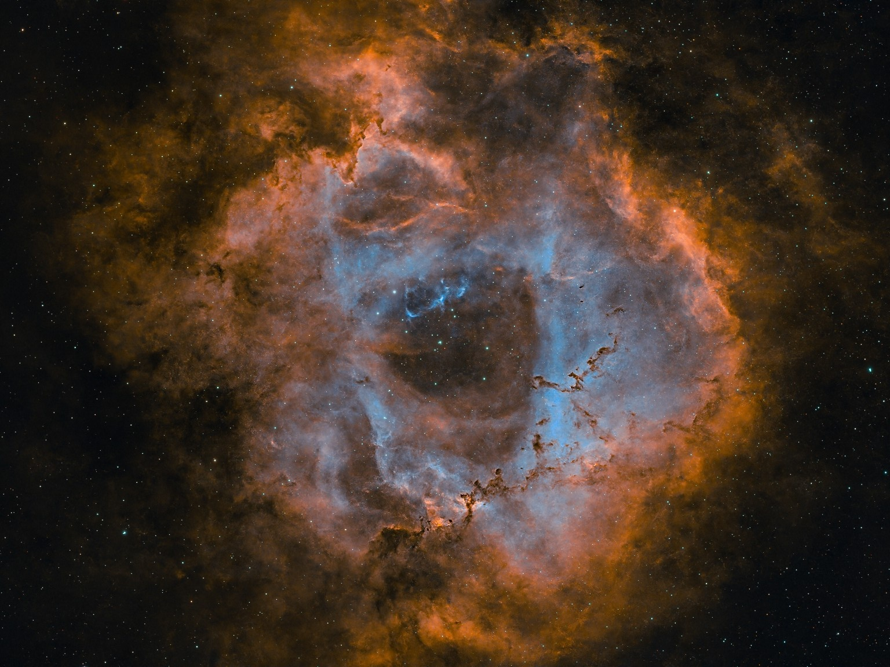

# AstroArchive

### Bring order to your astrophotography.

From a night’s captures to your next processing project.

**[Explore the website](https://astroarchive.arijguest.com)** &nbsp; · &nbsp; **[Read the guide](Application_Source/Quick_Start.txt)** &nbsp; · &nbsp; **[What’s new](https://github.com/arijguest/AstroArchive/releases)**

Windows 10 / 11 x64 &nbsp; · &nbsp; .NET Framework 4.8 &nbsp; · &nbsp; Archive and browse offline

Your nights under the stars, together in one place. Click any screenshot to explore it at full size.

| Keep every session organised | Pick up your next project | See your imaging progress |
| :--- | :--- | :--- |
| Find captures by target, telescope or session instead of digging through folders. | Gather the right files for processing and keep working copies with your archive. | Compare your targets, capture history and integration time with exportable analytics. |

**Explore:** [Import](#bring-the-night-straight-into-your-archive) · [Process](#give-your-next-processing-project-a-head-start) · [Analytics](#see-the-bigger-picture) · [Get started](#start-with-your-next-session)

## Bring the night straight into your archive

Keep capturing while AstroArchive brings new files into your collection. Import
from a folder or USB, or connect to **Seestar and DWARF over your local network**.

- **Let captures come to you.** Live import watches for completed files while the telescope app keeps shooting.
- **Run more than one telescope.** Each device has its own progress and controls; select extra files while live imports continue.
- **Pick up where you left off.** Pause and resume imports, including unfinished queues after a restart or update.
- **Keep track of the night.** Compact process summaries show progress, transfer speeds and results without interrupting your work.

Network imports retain telescope originals. Transfers and archive copies are
verified, duplicates are skipped, and completed copies survive interruptions.
Compatible firmware file access is required.
[Connection setup and troubleshooting →](docs/REMOTE_IMPORT.md)

## Give your next processing project a head start

Revisit an old favourite or finish last night’s session. Browse previews, choose
your captures, then prepare files for the processing software you already use.

| Find the right captures | Prepare the handoff | Keep the results together |
| :--- | :--- | :--- |
| Search targets and devices, expand grouped subs, and compare stills or recordings. | Export verified originals or compatible stacking folders with optional calibrations. | Keep working copies and returned outputs in **Edited**, alongside your archive. |

**Works with your workflow:** PixInsight · Siril · DeepSkyStacker · GIMP · Photoshop · AS!4 · AstroWizard · Stacking Wizard

Stacking and calibration run in your processing software.
[Explore processing handoffs →](docs/PROCESSOR_HANDOFFS.md)

## See the bigger picture

Where have you spent your imaging time? Which targets are ready for another pass?
**Repository → Analytics** turns your archive into six branded charts.

| Your question | Your chart |
| :--- | :--- |
| What have I photographed? | Targets photographed |
| How has my imaging changed over time? | Imaging timeline |
| Where have I invested the most exposure? | Time per target |
| How much imaging time has each telescope contributed? | Time per telescope |
| Which filters do I use most? | Filter mix |
| What exposure lengths do I shoot? | Exposure lengths |

Filter by acquisition dates or telescope, add a document label, and choose a
**Dark or Light** report. Export **PNG, JPEG, PDF or SVG**—one chart or all six in
one document, with 150 or 300 DPI for raster images.

<strong>What the analytics measure</strong>

Time means individual light-frame integration. Stacks, videos and calibrations
are excluded to avoid double counting; missing dates and exposures are reported.
The report starts with the entire repository independently of browsing filters.
Including rejected lights is optional. Long rankings continue across pages so
every target and telescope remains represented.

## Built around the captures you want to keep

**Verified copies. Original bytes. A collection you can return to.**

- Ordinary imports and exports preserve image bytes; source originals are kept by default.
- Preview stretches affect the display. Metadata edits update indexed labels, while **Fill missing metadata** previews supported additions without replacing existing values or user edits.
- Verified folder or lossless ZIP backups include images, Edited files and the database.

<strong>Formats and archive care</strong>

| Your files | Support |
| :--- | :--- |
| FITS / gzip FITS / XISF / TIFF / PNG | Scientific previews and eligible explicit FITS conversion |
| JPEG / GIF | Still or animated display; original-file export |
| SER / AVI / MP4 / MOV / M4V / WMV / MKV | Recording previews/playback within format and installed-codec limits |
| CR2 / CR3 / NEF / ARW / DNG | Original-file import/export; previews need a compatible Windows codec |
| Tile-compressed FITS / Zstandard XISF | Optional CFITSIO / Zstandard codecs for decoding |

Keep the whole repository, including `.astroarchive` and `Edited`, together when
moving it. Use one running AstroArchive instance per repository. Network sessions
within that instance coordinate their writes. Choose a separate drive for backups
where possible; optional NTFS **Protect originals** is not a substitute for backup.

[Format limits](docs/COMPATIBILITY.md) · [File and metadata safety](docs/SECURITY.md)

## Start with your next session

1. **[Download and install AstroArchive](https://github.com/arijguest/AstroArchive/releases/latest).** The default Windows installation needs no administrator access.
2. **Choose your archive:** **Settings → General → Choose repository**.
3. **Bring in your captures:** choose a folder and saved physical telescope on **Import**, then scan and review; or choose **Connect over network…**.
4. **Make it yours:** browse **Repository**, prepare an export, or open **Analytics**.

**Need a hand?** Press **F1** in the app, follow the [offline guide](Application_Source/Quick_Start.txt), or [report an issue](https://github.com/arijguest/AstroArchive/issues).

### Fresh from the latest releases

**[3.1.3](https://github.com/arijguest/AstroArchive/releases/tag/v3.1.3.1)** brings compact, dismissible process summaries and clearer repository layouts.
Recent releases added recoverable import queues, simultaneous telescope sessions,
and Dark or Light analytics documents.
[See what’s new →](https://github.com/arijguest/AstroArchive/releases)

## Go further

| Using AstroArchive | Building and contributing |
| :--- | :--- |
| [User guide](Application_Source/Quick_Start.txt) | [Build and focused checks](docs/DEVELOPMENT.md) |
| [Repeat USB and folder imports](docs/FAST_IMPORTS.md) | [Release and signing](docs/RELEASING.md) |
| [Network and live imports](docs/REMOTE_IMPORT.md) | [Licensing and notices](LICENSING.md) |
| [Processing handoffs](docs/PROCESSOR_HANDOFFS.md) | [Report an issue](https://github.com/arijguest/AstroArchive/issues) |
| [Installation and updates](docs/UPDATES.md) | [Website](https://astroarchive.arijguest.com) |

*Rosette Nebula · Ari J. Guest*

### More time with your images. Less time hunting for them.

**[Download AstroArchive for Windows](https://github.com/arijguest/AstroArchive/releases/latest)**

---

Source-available under [PolyForm Noncommercial 1.0.0](LICENSE). Commercial use
requires separate permission from Ari J. Guest; your images remain yours.

Catalogue data: [OpenNGC](Application_Source/Catalogue_Notice.md) ·
[GeoNames](Application_Source/City_Catalogue_Notice.md) ·
[D3-Celestial](Application_Source/Sky_Catalogue_Notice.md).
Network access: [SMBLibrary](Application_Source/Remote/lib/README.md), bundled as a
separate, replaceable DLL with matching source and licence notices.
Screenshots and photography: [sources and credits](docs/images/README.md).
